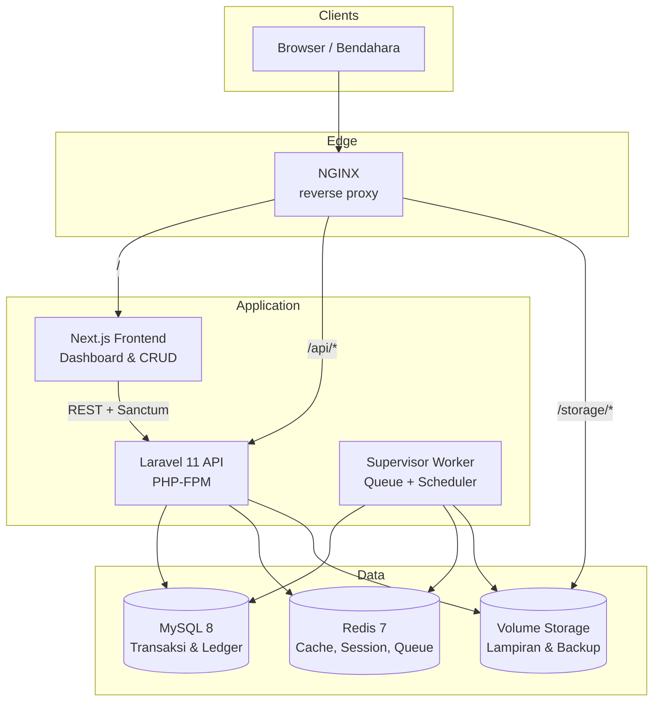
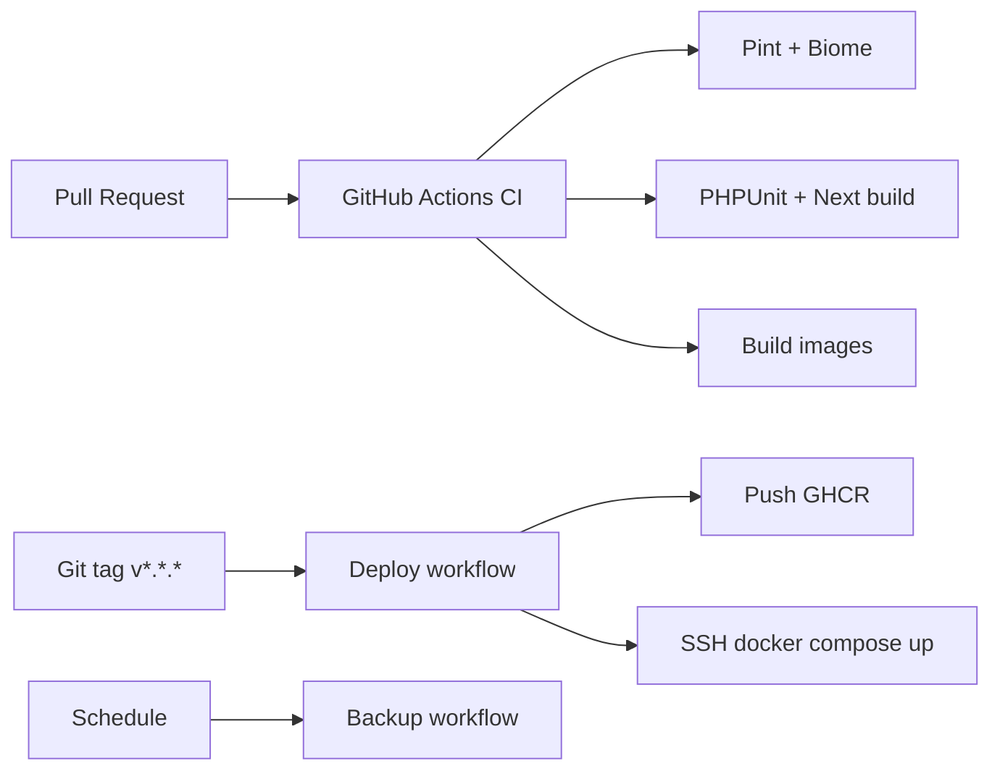

# Arsitektur SIMA

SIMA (Sistem Informasi Manajemen Amanah) adalah aplikasi full-stack untuk mengelola dana titipan lembaga sosial. Inti bisnis adalah **Amanah Ledger** — buku besar immutable yang menjadi sumber kebenaran tunggal.

## Diagram tingkat tinggi



## Komponen runtime (produksi)

| Komponen | Peran | Teknologi |
|----------|-------|-----------|
| **NGINX** | Terminasi HTTP, routing `/` → frontend, `/api` → Laravel, `/storage` → file publik | nginx:1.27-alpine |
| **Frontend** | UI dashboard, laporan, CRUD | Next.js 16, React, TanStack Table/Query |
| **API (app)** | REST API, auth Sanctum, RBAC, posting ledger | Laravel 11, PHP 8.2 FPM |
| **Worker** | Job queue + cron scheduler | Supervisor (queue:work + schedule:run) |
| **MySQL** | Data persisten (ledger append-only) | MySQL 8.0 |
| **Redis** | Cache, session, antrian job | Redis 7 |
| **Storage volume** | `storage/app`, backup DB, lampiran | Docker volume / S3 (opsional) |

## Aliran data finansial

Setiap transaksi finansial diposting ke `ledger_entries` melalui `LedgerService`:

```
Penerimaan (post)      →  Akun + , Dana SUSPENSE +
Alokasi (post)         →  Dana SUSPENSE − , Dana Tujuan +
Pengeluaran (approve)  →  Akun − , Dana Tujuan − (per expense_fund_sources)
Biaya Bank (post)      →  Akun − , Dana admin −
Reversal               →  Negasi seluruh leg transaksi sumber
```

Invariant: saldo akun ≥ 0, saldo dana ≥ 0, total akun = total dana (rekonsiliasi global).

## Keamanan & audit

- **Auth**: Laravel Sanctum (token API + cookie SPA untuk frontend same-origin)
- **RBAC**: spatie/laravel-permission (`admin`, `bendahara`, `verifikator`, `ketua`, `auditor`, `donatur`)
- **Audit**: owen-it/laravel-auditing → tabel `audit_logs`
- **Immutability**: trigger DB + model guard pada `ledger_entries`; koreksi hanya via reversal

## Observability

| Endpoint / job | Fungsi |
|----------------|--------|
| `GET /api/health` | Health check (DB, cache, Redis) — tanpa auth |
| `sima:check-balances` | Validasi drift saldo cache vs ledger (harian 02:00 WIB) |
| `sima:backup-db` | Dump MySQL terkompresi (harian 01:30 WIB) |
| `sima:prune-idempotency` | Bersihkan cache idempotency (harian 03:00 WIB) |

## CI/CD



## Lingkungan

| Lingkungan | Compose file | Catatan |
|------------|--------------|---------|
| Development | `docker-compose.yml` | Volume mount kode, debug on, port 8080 |
| Production | `docker-compose.prod.yml` | Image baked, Redis wajib, Supervisor worker |

## Referensi kode

- Service layer: `app/Services/`
- Ledger: `app/Services/LedgerService.php`
- API routes: `routes/api.php`
- Frontend API client: `frontend/src/lib/api/client.ts`
- Docker: `Dockerfile`, `docker-compose.prod.yml`, `docker/nginx/production.conf`
