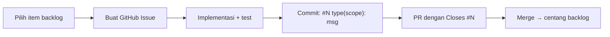

# Backlog SIMA — Fitur & Pekerjaan Belum Selesai

Daftar pekerjaan terstruktur agar tim bisa mengerjakan **satu per satu**. Centang `- [x]` saat selesai.

> **Aturan agent (WAJIB):** sebelum mengerjakan item di bawah, **buat GitHub Issue dulu**, lalu setiap commit **awali dengan `#<nomor-issue>`** (mis. `#42 feat(opening): ...`). Detail: [AGENTS.md](../AGENTS.md#backlog--github-issue-wajib-untuk-agent) · [CONTRIBUTING.md](CONTRIBUTING.md#issue-dan-commit).

**Prioritas:**

| Label | Arti |
|-------|------|
| **P0** | Blocker go-live / operasional harian tidak bisa |
| **P1** | Penting untuk produksi nyaman |
| **P2** | Menambah kelengkapan & efisiensi |
| **P3** | Nice-to-have / refactor / dokumentasi |

**Dokumen terkait:** [PANDUAN-MULAI.md](PANDUAN-MULAI.md) · [DANA-AMANAH.md](DANA-AMANAH.md)

---

## P0 — Go-live & fondasi operasional

### Saldo awal (opening balance)

- [x] **API posting saldo awal** — endpoint terkelola (mis. `POST /opening-balances`) dengan validasi role admin, transaksi `opening`, dukung banyak baris (akun + dana + nominal)
- [x] **UI posting saldo awal** — wizard go-live: review worksheet (input manual), preview jurnal, eksekusi batch *(upload Excel & cetak bukti belum)*
- [x] **Gunakan dana `opening_equity` sebagai lawan** — selaras desain `SYS-OPENING` (bukan hanya shortcut ke Dana Operasional)
- [x] **Laporan saldo awal** — daftar posting opening per tanggal cutover (audit go-live)
- [ ] **Dokumentasi** — update [PANDUAN-MULAI.md](PANDUAN-MULAI.md) Fase 4 setelah UI/API siap

### Manajemen pengguna

- [ ] **Backend: CRUD user** — API `users` (create, update, nonaktifkan, reset password) + policy `user.manage`
- [ ] **Backend: assign role** — endpoint sync role Spatie per user
- [ ] **Frontend: halaman Pengaturan → Users** — ganti placeholder `/dashboard/settings`
- [ ] **Frontend: form user** — email, nama, role, status aktif
- [ ] **Produksi: hapus ketergantungan seeder demo** — prosedur buat admin pertama tanpa `*@sima.test`

---

## P1 — Modul master & keuangan (UI belum lengkap)

### Vendor

- [ ] **Migration + model `vendors`** — master vendor/penerima
- [ ] **Backend API** — CRUD vendor + permission (`vendor.view`, `vendor.manage`)
- [ ] **Relasi opsional** — `disbursements.vendor_id`, `bank_fees` bila relevan
- [ ] **Frontend CRUD** — aktifkan `/dashboard/vendors` (saat ini placeholder)
- [ ] **Laporan Per Vendor** — sumber data dari master, bukan hanya field `payee`

### Rekonsiliasi bank

- [ ] **Frontend: buat rekonsiliasi** — form periode, akun bank, saldo rekening koran
- [ ] **Frontend: tambah baris / item reconciling** — deferred bank fee, selisih
- [ ] **Frontend: complete rekonsiliasi** — workflow status draft → complete
- [ ] **Detail halaman rekonsiliasi** — `/dashboard/reconciliations/[id]`
- [ ] *(Backend API sudah ada; UI saat ini list-only)*

### Liabilitas operasional

- [ ] **Frontend: tambah liabilitas** — form create (`POST /liabilities`)
- [ ] **Frontend: edit liabilitas** — update draft
- [ ] **Frontend: settle** — tautkan ke pengeluaran approved
- [ ] **Frontend: void** — dengan alasan
- [ ] **Detail halaman** — `/dashboard/liabilities/[id]`
- [ ] *(Backend API sudah ada; UI saat ini list-only)*

### Transfer antar rekening

- [ ] **Desain alur** — transfer = double entry antar `accounts` + dampak dana amanah (jika perlu)
- [ ] **Backend** — service + API + permission
- [ ] **Frontend** — aktifkan menu Transfer (sidebar: `disabled`, badge `soon`)
- [ ] **Laporan / ledger** — tipe transaksi `transfer` konsisten di laporan

### Portal donatur

- [ ] **Frontend portal** — ganti placeholder `/dashboard/portal-donatur`
- [ ] **Backend portal** — endpoint sudah ada (`/portal/*`); lengkapi UI profil, ringkasan, riwayat donasi
- [ ] **Link user ↔ donatur** — `donors.user_id` + onboarding donatur login
- [ ] **Permission & isolasi data** — donatur hanya lihat penerimaan sendiri

---

## P1 — Permission & workflow operasional

- [ ] **Kebijakan: bendahara kelola Dana Amanah?** — saat ini hanya `fund.view`; pertimbangkan `fund.manage` terbatas atau delegasi admin
- [ ] **Kebijakan: bendahara kelola Kas/Bank?** — saat ini hanya `account.view`; pertimbangan serupa
- [ ] **Halaman Approval** — pastikan tab/filter cover penerimaan + pengeluaran + edge cases
- [ ] **Notifikasi approval** — email/in-app (opsional P2)

---

## P2 — Kualitas backend & API

### Standarisasi (sesuai CLAUDE.md / AGENTS.md)

- [ ] **Form Request** — pindahkan validasi inline controller ke `app/Http/Requests/` untuk semua endpoint
- [ ] **API Resource** — response konsisten via Resource, bukan Eloquent mentah
- [ ] **Update OpenAPI + Postman** — setiap endpoint baru/refactor

### Modul & validasi

- [ ] **Filter `type=operational` di list funds** — selaraskan dengan DB (operational = dana sistem `system_key`, bukan enum `type`)
- [ ] **Import bulk master** — CSV/API untuk donatur, dana, akun (opsional tapi mempercepat go-live)
- [ ] **Command artisan resmi saldo awal** — `sima:post-opening` menggantikan script ad-hoc/Tinker

### Audit & compliance

- [ ] **Migrasi ke Spatie Activity Log** — hanya jika diminta eksplisit (saat ini owen-it + Audit domain)
- [ ] **Laporan audit export** — PDF/Excel dari `/dashboard/reports/audit`

---

## P2 — Frontend & UX

- [ ] **Indikator loading saat filter laporan** — hindari persepsi hang (mis. laporan Approval)
- [ ] **Halaman error/empty state konsisten** — semua modul CRUD punya retry
- [ ] **Bahasa UI** — label `Restricted`/`Submitted` → Indonesia bila diinginkan organisasi
- [ ] **Role & menu Pengaturan** — sub-menu Users, Role (read-only), preferensi org
- [ ] **Hapus/arsip template legacy dashboard** — `(legacy)/analytics-v1`, `crm-v1`, dll. jika tidak dipakai SIMA
- [ ] **Build CI** — pastikan middleware Next.js (`proxy` vs deprecated `middleware`) di-upgrade saat stabil

---

## P2 — DevOps & produksi

- [ ] **Push repo GitHub** — monorepo root (frontend sudah diintegrasi)
- [ ] **Environment checklist produksi** — `.env.production`, secret rotation, backup restore drill
- [ ] **Monitoring** — alert jika `sima:check-balances` gagal (drift saldo)
- [ ] **Dokumentasi runbook** — incident reversal, restore DB, rollback deploy

---

## P3 — Laporan & analitik

- [ ] **Laporan rekonsiliasi global di UI** — tampilkan `GET /reports/reconciliation-summary` di dashboard
- [ ] **Export semua laporan** — parity PDF/Excel seperti modul laporan existing
- [ ] **Laporan arus kas** — belum ada di sidebar
- [ ] **Dashboard SIMA** — metric cards real data (bukan template demo)

---

## P3 — Dokumentasi & sinkronisasi

- [ ] **Update CLAUDE.md / AGENTS.md** — status frontend sudah ada; hapus “belum dibuat seluruh frontend”
- [ ] **Update README** — daftar modul UI yang sudah/s belum lengkap
- [ ] **Video/walkthrough bendahara** — opsional, non-kode
- [ ] **Template worksheet opening balance** — file `.xlsx` contoh di `docs/templates/`

---

## Selesai (referensi)

Item yang sudah dikerjakan — pindahkan ke sini saat centang selesai.

- [x] **Monorepo Git** — `frontend/.git` dihapus; satu repo root
- [x] **CRUD Biaya Bank (UI)** — list, create, detail, post, reverse
- [x] **Dokumen Dana Amanah** — [DANA-AMANAH.md](DANA-AMANAH.md)
- [x] **Panduan go-live master data** — [PANDUAN-MULAI.md](PANDUAN-MULAI.md)
- [x] **Fix hang laporan Approval** — infinite re-render TanStack Table
- [x] **Build frontend** — perbaikan TypeScript & syntax `bank-fee.ts`

---

## Cara memakai backlog ini

### Workflow wajib (agent & contributor)

1. Pilih **satu item** (utamakan P0 → P1).
2. **Buat issue** di GitHub (`gh issue create`) — judul: `[P0] ringkasan item`.
3. Salin nomor issue (mis. `#42`) ke notes; **jangan coding sebelum issue ada**.
4. Kerjakan scope minimal — **satu issue = satu PR**.
5. **Commit:** prefix `#42` di awal setiap commit yang terkait issue itu.
6. **PR:** sertakan `Closes #42` di body.
7. Setelah merge: centang `- [x]` di file ini; issue otomatis tertutup jika PR memakai `Closes`.

### Aturan tambahan

- Jangan campur banyak item backlog dalam satu issue/PR.
- Update [PANDUAN-MULAI.md](PANDUAN-MULAI.md) jika item mengubah prosedur go-live.
- Jika issue sudah ada untuk item yang sama, **pakai issue tersebut** — jangan buat duplikat.

**Terakhir diperbarui:** Jun 2026
