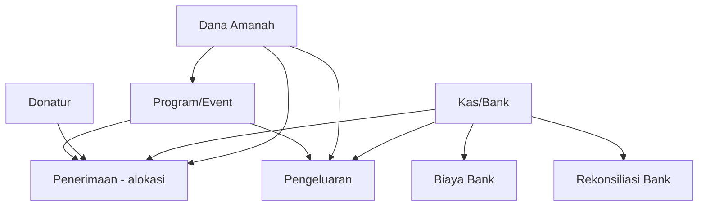

# Panduan Memulai SIMA — Entry Data Awal & Master Data

Dokumen ini menjelaskan **langkah demi langkah** yang harus dilakukan sebuah organisasi lembaga sosial untuk **pertama kali** menggunakan SIMA, dengan fokus pada **persiapan master data** dan **saldo awal (go-live)**.

> **Cakupan:** panduan operasional untuk admin, bendahara, dan tim implementasi.  
> **Bukan** panduan instalasi server — lihat [DEPLOYMENT.md](DEPLOYMENT.md).  
> **Konsep Dana Amanah:** lihat [DANA-AMANAH.md](DANA-AMANAH.md).

---

## Ringkasan eksekutif

SIMA memisahkan dua dimensi uang:

| Dimensi | Master data | Contoh |
|---------|-------------|--------|
| **Di mana uang berada** | Kas/Bank (`accounts`) | Kas kantor, Rekening BCA |
| **Untuk apa uang boleh dipakai** | Dana Amanah (`funds`) | Zakat, Infaq Yatim, Operasional |

**Urutan besar yang disarankan:**

```
Persiapan organisasi
  → Instalasi & seed sistem
  → Pengguna & role
  → Dana Amanah
  → Kas/Bank
  → Donatur & Program (opsional tapi disarankan)
  → Saldo awal (opening balance)
  → Verifikasi laporan & rekonsiliasi
  → Operasional harian (penerimaan, pengeluaran, dll.)
```

---

## Fase 0 — Persiapan organisasi (sebelum sentuh sistem)

Lakukan di rapat bendahara + ketua + admin IT. **Jangan** langsung input data tanpa rencana ini.

### 0.1 Tentukan tanggal cutover (go-live)

- **Tanggal cutover** = hari pertama SIMA menjadi buku resmi.
- Semua saldo per **tanggal cutover** harus dicatat sebagai **saldo awal**.
- Transaksi **setelah** tanggal cutover dicatat normal (penerimaan, pengeluaran, biaya bank).

### 0.2 Kumpulkan data sumber (spreadsheet)

Siapkan worksheet dengan kolom minimal:

| Kolom | Keterangan |
|-------|------------|
| Rekening kas/bank | Nama, bank, no. rekening |
| Saldo per rekening (cutover) | Sesuai mutasi bank / hitung kas fisik |
| Pemecahan per Dana Amanah | Mis. BCA Rp 500 jt = Zakat 300 jt + Operasional 200 jt |
| Daftar donatur aktif | Nama, kontak (opsional) |
| Daftar program/event | Nama, periode, dana terkait |
| Daftar pengguna | Nama, email, role |

**Aturan penting:** total saldo semua **Kas/Bank** harus sama dengan total saldo semua **Dana Amanah** (rekonsiliasi global SIMA).

### 0.3 Tetapkan kebijakan Dana Amanah

Sebelum input master, sepakati daftar dana. Lihat [DANA-AMANAH.md](DANA-AMANAH.md):

- **`restricted`** — terikat niat donatur (Zakat, Infaq program X, Wakaf, dll.)
- **`unrestricted`** — dana umum lembaga

Dana **sistem** (Suspense, Operasional, Biaya Bank, Opening Equity) sudah dibuat otomatis saat seed — **jangan duplikasi**.

### 0.4 Tetapkan pemetaan role

| Role SIMA | Siapa di organisasi | Peran saat setup |
|-----------|---------------------|------------------|
| **admin** | IT / super user | Instalasi, master Dana Amanah & Kas/Bank, saldo awal teknis |
| **bendahara** | Bendahara | Donatur, program, transaksi harian |
| **verifikator** | Staff verifikasi | Review pengeluaran |
| **ketua** | Ketua/pimpinan | Approval penerimaan & pengeluaran |
| **auditor** | Auditor internal | Cek laporan & audit trail |

Detail permission: [README.md — Role & Permission](../README.md#role--permission).

---

## Fase 1 — Instalasi & fondasi sistem

### 1.1 Deploy / development environment

Ikuti [DEPLOYMENT.md](DEPLOYMENT.md) atau Quick Start di [README.md](../README.md).

### 1.2 Migrasi & seed wajib

```bash
php artisan migrate --seed
```

Seed otomatis membuat:

| Hasil seed | Fungsi |
|------------|--------|
| **Role & permission** | RBAC (`admin`, `bendahara`, `verifikator`, `ketua`, `auditor`, `donatur`) |
| **Dana sistem** | Suspense, Operasional, Biaya Admin Bank, Opening Equity |
| **User contoh** | Satu akun per role (password dev: `password`) |

**Setelah produksi:** ganti password semua user contoh, buat user nyata organisasi.

### 1.3 Verifikasi health

```bash
curl -s https://<domain-anda>/api/health
```

Pastikan database & cache terhubung.

### 1.4 Login pertama

- URL frontend: `/auth/v2/login` (atau sesuai deploy)
- Login sebagai **admin** untuk fase master data inti
- Ganti password akun demo sebelum go-live produksi

---

## Fase 2 — Pengguna & akses

### 2.1 Buat akun pengguna organisasi

| Status UI | Keterangan |
|-----------|------------|
| Menu **Pengaturan** (`/dashboard/settings`) | Belum tersedia (placeholder) |
| API / database | User dibuat manual: seeder, `php artisan tinker`, atau insert via tim IT |

**Langkah praktis saat ini:**

1. Duplikasi pola `database/seeders/UserSeeder.php` untuk email organisasi, **atau**
2. Minta tim teknis membuat user via Tinker / script one-off
3. Assign role Spatie: `admin`, `bendahara`, `verifikator`, `ketua`, `auditor`

### 2.2 Checklist akun minimum go-live

| # | Email (contoh) | Role | Wajib? |
|---|----------------|------|--------|
| 1 | admin@lembaga.org | admin | Ya |
| 2 | bendahara@lembaga.org | bendahara | Ya |
| 3 | verifikator@lembaga.org | verifikator | Ya (jika ada workflow pengeluaran) |
| 4 | ketua@lembaga.org | ketua | Ya (approval) |
| 5 | auditor@lembaga.org | auditor | Disarankan |

### 2.3 Nonaktifkan akun demo

Setelah user produksi aktif, nonaktifkan atau hapus `*@sima.test` dari seeder development.

---

## Fase 3 — Master data (urutan input)

Master data punya **dependensi**. Ikuti urutan ini agar form transaksi tidak kehabisan pilihan.



### 3.1 Dana Amanah — **Admin**

| Item | Detail |
|------|--------|
| **Menu** | Master Data → **Dana Amanah** (`/dashboard/funds`) |
| **Permission** | `fund.manage` — **hanya admin** (bendahara: lihat saja) |
| **Yang sudah ada (sistem)** | SYS-SUSPENSE, SYS-OPERASIONAL, SYS-BANKADMIN, SYS-OPENING — **jangan edit/hapus** |

**Langkah:**

1. Review dana sistem di daftar (sudah dari seed).
2. Klik **Tambah Dana Amanah** untuk setiap dana organisasi.
3. Isi:
   - **Kode** — unik, singkat (mis. `ZKT`, `IF-YATIM`, `UMUM`)
   - **Nama** — nama resmi peruntukan
   - **Tipe** — `restricted` untuk donasi berperuntukan; `unrestricted` untuk dana umum
   - **Deskripsi** — opsional, catat kebijakan internal
   - **Aktif** — centang
4. Cocokkan dengan spreadsheet Fase 0.

**Contoh daftar tipikal lembaga sosial:**

| Kode | Nama | Tipe |
|------|------|------|
| ZKT | Zakat Mustahik | restricted |
| IF-YY | Infaq Yatim | restricted |
| WKF | Wakaf | restricted |
| UMUM | Dana Sosial Umum | unrestricted |

> Dana Operasional sistem sudah ada untuk beban internal — tidak perlu buat duplikat kecuali kebijakan organisasi mengharuskan nama berbeda (biasanya cukup pakai SYS-OPERASIONAL).

---

### 3.2 Kas / Bank — **Admin**

| Item | Detail |
|------|--------|
| **Menu** | Master Data → **Kas / Bank** (`/dashboard/accounts`) |
| **Permission** | `account.manage` — **hanya admin** |
| **Saldo di form** | **Read-only** — saldo dihitung dari ledger, tidak bisa diisi manual di form |

**Langkah:**

1. **Tambah Kas/Bank** untuk setiap lokasi uang fisik.
2. Isi:
   - **Kode** — mis. `KAS-01`, `BCA-UTAMA`
   - **Nama** — mis. `Kas Kantor Pusat`, `Rekening BCA Operasional`
   - **Tipe** — `cash` atau `bank`
   - Untuk bank: **Nama Bank**, **No. Rekening**, **Pemilik Rekening**
   - **Aktif** — centang
3. Setelah disimpan, saldo awal masih **Rp 0** — normal. Saldo diisi di **Fase 4**.

**Tips:**

- Pisahkan kas kecil kantor cabang vs rekening bank pusat.
- Nonaktifkan (`is_active = false`) rekening yang sudah ditutup — jangan hapus jika pernah ada transaksi.

---

### 3.3 Donatur — **Bendahara atau Admin**

| Item | Detail |
|------|--------|
| **Menu** | Master Data → **Donatur** (`/dashboard/donors`) |
| **Permission** | `donor.manage` — admin & bendahara |

**Langkah:**

1. **Tambah Donatur** per baris spreadsheet donatur.
2. Field wajib: **Nama**, **Tipe** (individu/lembaga).
3. **Kode** — otomatis (`DON/2026/000001`, …).
4. Email/telepon/alamat — isi jika ada (opsional tapi disarankan untuk laporan & portal donatur ke depan).
5. Import massal — **belum ada UI**; input manual atau script custom tim IT.

**Kapan wajib sebelum transaksi?**

- Wajib jika penerimaan akan dilink ke donatur.
- Boleh ditunda jika fase awal hanya saldo opening tanpa histori per donatur.

---

### 3.4 Event / Program — **Bendahara atau Admin**

| Item | Detail |
|------|--------|
| **Menu** | Master Data → **Event** (`/dashboard/programs`) |
| **Permission** | `program.manage` — admin & bendahara |

**Langkah:**

1. **Tambah Event/Program** untuk kegiatan yang perlu dilacak anggarannya.
2. Isi:
   - **Dana Amanah** — opsional; kaitkan ke dana utama program
   - **Kode**, **Nama**, **Deskripsi**
   - **Anggaran**, **Tanggal mulai/selesai**
   - **Status** — `planned` / `active` / `closed`
3. Program **tidak wajib** untuk setiap penerimaan/pengeluaran, tapi disarankan untuk laporan **Per Event**.

---

### 3.5 Modul master belum tersedia

| Modul | Status | Dampak go-live |
|-------|--------|----------------|
| **Vendor** | Belum ada backend/UI penuh | Field penerima pengeluaran: teks bebas (`payee`) |
| **Transfer antar rekening** | Menu disabled (`soon`) | Transfer manual = kombinasi pengeluaran + penerimaan, atau tunggu modul |
| **Pengaturan user (UI)** | Placeholder | User via seeder/Tinker |

---

## Fase 4 — Saldo awal (opening balance)

Ini fase **paling kritis**. Tanpa saldo awal, Kas/Bank dan Dana Amanah tetap nol meskipun master sudah lengkap.

### 4.1 Konsep

- Saldo awal = uang yang **sudah ada** sebelum SIMA jalan.
- **Bukan** penerimaan donasi — jangan buat penerimaan fiktif untuk “menyisakan” saldo.
- Secara konsep akuntansi SIMA, lawan saldo awal adalah dana sistem **Opening Equity** (`SYS-OPENING`) — lihat [DANA-AMANAH.md](DANA-AMANAH.md).

Posting teknis memakai transaksi bertipe **`opening`** ke ledger (`TransactionType::OPENING`).

### 4.2 Status fitur saat ini

| Fitur | Status |
|-------|--------|
| UI “Posting Saldo Awal” | **Belum ada** |
| Form Kas/Bank → isi saldo | **Tidak bisa** (saldo read-only dari ledger) |
| API dedicated `/opening-balances` | **Belum ada** |
| Posting via `LedgerService` | **Ada** (dipakai internal/test) |

### 4.3 Prosedur go-live yang disarankan

**Opsi A — Cutover penuh (organisasi sudah punya saldo riil)**

1. Admin + tim teknis siapkan **worksheet pemetaan opening**:

   | Akun Kas/Bank | Dana Amanah | Nominal (Rp) | Catatan |
   |---------------|-------------|--------------|---------|
   | BCA-UTAMA | ZKT | 300.000.000 | Saldo zakat per bank statement 30/06 |
   | BCA-UTAMA | SYS-OPERASIONAL | 200.000.000 | Bagian operasional |
   | KAS-01 | UMUM | 5.000.000 | Kas fisik kantor |

2. Tim teknis posting setiap baris via **`LedgerService::postAmanahMovement`** dengan:
   - `TransactionType::OPENING`
   - Akun terkait
   - `fund_id` sesuai kolom Dana Amanah
   - `LedgerMovement::IN`
   - Referensi: `"Saldo awal cutover YYYY-MM-DD"`

   > Implementasi saat ini di test helper: `tests/Concerns/SimaTestHelpers::seedOpening()`. Tim IT dapat menyiapkan **artisan command one-off** atau script migrasi data — **koordinasi dengan pengembang**, bukan input bendahara via UI.

3. Bendahara **verifikasi** (Fase 5) — bukan input ulang.

**Opsi B — Soft start (organisasi menerima saldo nol di SIMA)**

- Mulai SIMA dengan master kosong saldo.
- Hanya catat transaksi **setelah** tanggal cutover.
- **Kekurangan:** laporan SIMA tidak reflect uang yang sudah ada di bank sebelum cutover.
- Hanya cocok jika organisasi consciously reset buku atau saldo awal sangat kecil.

**Opsi C — Saldo awal hanya ke Dana Operasional (sementara)**

- Jika pemecahan per dana belum siap, posting sementara seluruh saldo per rekening ke **Dana Operasional**.
- **Re-alloc** ke restricted/unrestricted dilakukan belakangan via mekanisme internal (adjustment — butuh kebijakan & fitur teknis).
- Catat utang teknis: saldo restricted belum akurat.

### 4.4 Aturan setelah opening

- Jangan edit/hapus entri opening manual di database.
- Koreksi hanya lewat **reversal** + posting opening yang benar (prosedur terkontrol admin).
- Pastikan tidak ada **double opening** (posting dua kali untuk rekening yang sama).

---

## Fase 5 — Verifikasi sebelum operasional penuh

Lakukan sebagai **admin + bendahara + auditor** bersama.

### 5.1 Laporan wajib dicek

| Laporan | Menu | Yang dicek |
|---------|------|------------|
| **Saldo Dana Amanah** | Laporan → Saldo Dana Amanah | Sesuai worksheet per dana |
| **Saldo rekening** | Master → Kas/Bank (kolom saldo) | Sesuai mutasi bank / hitung kas |
| **Rekonsiliasi global** | API `GET /reports/reconciliation-summary` atau dashboard | **Selisih = 0** (total kas/bank = total dana) |
| **Ledger** | Laporan → Ledger | Ada baris `opening` per pemetaan |

### 5.2 Checklist angka

- [ ] Setiap rekening bank: saldo SIMA = saldo rekening koran per tanggal cutover
- [ ] Total semua rekening = total semua dana amanah
- [ ] Tidak ada dana restricted negatif
- [ ] Dana sistem (Suspense) saldo masuk akal — idealnya mendekati nol jika belum ada penerimaan baru
- [ ] User tiap role bisa login dan melihat menu sesuai permission

### 5.3 Rekonsiliasi bank (opsional fase awal)

| Item | Detail |
|------|--------|
| **Menu** | Belum ada modul CRUD lengkap di UI (daftar read-only) |
| **API** | `POST /bank-reconciliations` tersedia |

Rekonsiliasi bank pertama kali bisa dilakukan akhir bulan pertama operasi SIMA.

---

## Fase 6 — Mulai operasional harian (setelah master & opening)

Setelah Fase 3–5 selesai, alur harian:

| Urutan | Modul | Role tipikal | Catatan |
|--------|-------|--------------|---------|
| 1 | **Penerimaan** | Bendahara buat → Ketua approve | Wajib **alokasi dana** = total penerimaan |
| 2 | **Pengeluaran** | Bendahara submit → Verifikator verify → Ketua approve | Multi sumber dana via `expense_fund_sources` |
| 3 | **Biaya Bank** | Bendahara buat → Post | Default dana: Operasional; **bukan** restricted |
| 4 | **Liabilitas operasional** | Bendahara | Tagihan tertunda (gaji, sewa) — UI terbatas |
| 5 | **Laporan** | Semua role view | Audit trail untuk auditor |

Workflow approval: menu **Approval** atau laporan Approval.

---

## Matriks: siapa input apa?

| Master / Aksi | Admin | Bendahara | Verifikator | Ketua |
|---------------|:-----:|:---------:|:-----------:|:-----:|
| Dana Amanah (CRUD) | ✅ | lihat | lihat | lihat |
| Kas/Bank (CRUD) | ✅ | lihat | lihat | lihat |
| Donatur | ✅ | ✅ | lihat | lihat |
| Program/Event | ✅ | ✅ | lihat | lihat |
| Saldo awal (opening) | ✅* | — | — | — |
| Penerimaan | ✅ | ✅ buat/submit | lihat | approve |
| Pengeluaran | ✅ | ✅ buat/submit | verify | approve |
| Biaya bank | ✅ | ✅ | lihat | lihat |

\* Posting opening saat ini **teknis/IT**, bukan bendahara via UI.

---

## Checklist go-live (printable)

### Persiapan

- [ ] Tanggal cutover ditetapkan
- [ ] Spreadsheet saldo & pemetaan dana selesai
- [ ] Daftar dana amanah disepakati
- [ ] Daftar rekening kas/bank disepakati
- [ ] User & role produksi dibuat
- [ ] Password demo diganti

### Master data di SIMA

- [ ] Dana sistem terverifikasi (seed)
- [ ] Dana amanah organisasi diinput
- [ ] Kas/bank diinput
- [ ] Donatur diinput (jika dipakai)
- [ ] Program diinput (jika dipakai)

### Saldo awal

- [ ] Worksheet opening disetujui ketua
- [ ] Posting opening dieksekusi tim teknis
- [ ] Saldo per rekening cocok
- [ ] Rekonsiliasi global selisih = 0

### Operasional

- [ ] Bendahara training: penerimaan + alokasi
- [ ] Verifikator & ketua training: approval
- [ ] Prosedur reversal dipahami (tidak ada hapus transaksi)

---

## Kesalahan umum

| Kesalahan | Mengapa bermasalah | Solusi |
|-----------|-------------------|--------|
| Buat penerimaan fiktif untuk saldo awal | Menyimpang niat donatur; audit salah | Pakai posting **opening** |
| Isi saldo di form Kas/Bank | Field tidak editable; tidak ada efek | Posting ke ledger |
| Bebankan biaya bank ke dana **restricted** | Ditolak sistem | Pakai Dana Operasional |
| Lupa alokasi pada penerimaan | Tidak bisa submit/approve | Total alokasi = nominal penerimaan |
| Hapus transaksi approved | Melanggar prinsip ledger | **Reverse** saja |
| Bendahara buat Dana Amanah | Permission ditolak | Minta admin |
| Double posting opening | Saldo dobel | Satu kali posting per baris worksheet |

---

## Referensi menu UI (frontend)

| Master | Path |
|--------|------|
| Dana Amanah | `/dashboard/funds` |
| Kas/Bank | `/dashboard/accounts` |
| Donatur | `/dashboard/donors` |
| Event/Program | `/dashboard/programs` |
| Penerimaan | `/dashboard/receipts` |
| Pengeluaran | `/dashboard/disbursements` |
| Biaya Bank | `/dashboard/bank-fees` |
| Laporan | `/dashboard/reports` |

---

## Dokumen terkait

- [DANA-AMANAH.md](DANA-AMANAH.md) — restricted vs unrestricted, dana sistem
- [BACKLOG.md](BACKLOG.md) — daftar pekerjaan belum selesai
- [ARCHITECTURE.md](ARCHITECTURE.md) — aliran ledger
- [DEPLOYMENT.md](DEPLOYMENT.md) — deploy produksi
- [README.md](../README.md) — konsep inti & role

---

## Catatan versi dokumen

| Tanggal | Catatan |
|---------|---------|
| Jun 2026 | Draft awal — mencerminkan kondisi UI/API saat penulisan (opening balance & user UI belum tersedia di dashboard). Perbarui dokumen ini saat fitur go-live UI dirilis. |
