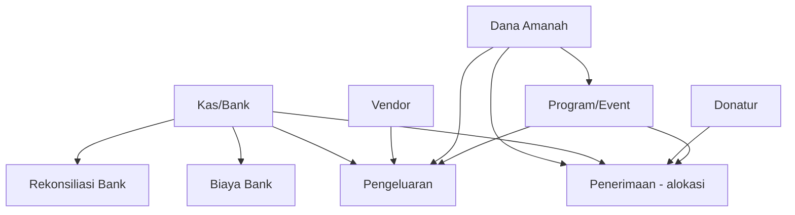

# Panduan Memulai SIMA — Go-live & Operasional Awal

Dokumen ini menjelaskan **langkah demi langkah** yang harus dilakukan lembaga sosial saat pertama kali menggunakan SIMA: deploy produksi, menyiapkan pengguna dan master data, mem-posting saldo awal, memverifikasi buku, lalu menjalankan transaksi keuangan dan pengajuan bantuan.

> **Cakupan:** panduan operasional untuk admin, bendahara, ketua, petugas bantuan, auditor, dan tim implementasi.
> **Bukan** panduan instalasi server — lihat [DEPLOYMENT.md](DEPLOYMENT.md).  
> **Konsep Dana Amanah:** lihat [DANA-AMANAH.md](DANA-AMANAH.md).
> **Kontrak Pengajuan Bantuan:** lihat [BANTUAN.md](BANTUAN.md).

---

## Ringkasan eksekutif

SIMA memisahkan dua dimensi uang:

| Dimensi | Master data | Contoh |
|---------|-------------|--------|
| **Di mana uang berada** | Kas/Bank (`accounts`) | Kas kantor, Rekening BCA |
| **Untuk apa uang boleh dipakai** | Dana Amanah (`funds`) | Zakat, Infaq Yatim, Operasional |

**Urutan besar yang disarankan:**

```
Persiapan organisasi
  → Instalasi & seed sistem
  → Pengguna & role
  → Dana Amanah
  → Kas/Bank
  → Donatur, Vendor & Program (sesuai kebutuhan)
  → Saldo awal (opening balance)
  → Verifikasi laporan & rekonsiliasi
  → Operasional keuangan
  → Operasional pengajuan bantuan
```

---

## Fase 0 — Persiapan organisasi (sebelum sentuh sistem)

Lakukan di rapat bendahara + ketua + admin IT. **Jangan** langsung input data tanpa rencana ini.

### 0.1 Tentukan tanggal cutover (go-live)

- **Tanggal cutover** = hari pertama SIMA menjadi buku resmi.
- Semua saldo per **tanggal cutover** harus dicatat sebagai **saldo awal**.
- Transaksi **setelah** tanggal cutover dicatat normal (penerimaan, pengeluaran, biaya bank).

### 0.2 Kumpulkan data sumber (spreadsheet)

Siapkan worksheet dengan kolom minimal:

| Kolom | Keterangan |
|-------|------------|
| Rekening kas/bank | Nama, bank, no. rekening |
| Saldo per rekening (cutover) | Sesuai mutasi bank / hitung kas fisik |
| Pemecahan per Dana Amanah | Mis. BCA Rp 500 jt = Zakat 300 jt + Operasional 200 jt |
| Daftar donatur aktif | Nama, kontak (opsional) |
| Daftar vendor/penerima pembayaran | Nama, kontak, data pajak/bank jika dipakai |
| Daftar program/event | Nama, periode, dana terkait |
| Daftar pengguna | Nama, email, role |
| Kebijakan bantuan | Siapa koordinator, verifikator, petugas serah terima, bukti, dan jalur tunai/transfer |

**Aturan penting:** total saldo semua **Kas/Bank** harus sama dengan total saldo semua **Dana Amanah** (rekonsiliasi global SIMA).

### 0.3 Tetapkan kebijakan Dana Amanah

Sebelum input master, sepakati daftar dana. Lihat [DANA-AMANAH.md](DANA-AMANAH.md):

- **`restricted`** — terikat niat donatur (Zakat, Infaq program X, Wakaf, dll.)
- **`unrestricted`** — dana umum lembaga

Dana **sistem** (Suspense, Operasional, Biaya Bank, Opening Equity) sudah dibuat otomatis saat seed — **jangan duplikasi**.

### 0.4 Tetapkan pemetaan role

| Role SIMA | Siapa di organisasi | Peran saat setup |
|-----------|---------------------|------------------|
| **admin** | IT / super user | Instalasi, master Dana Amanah & Kas/Bank, saldo awal teknis |
| **asisten_bendahara** | Asisten bendahara / staff input | Input master harian, penerimaan, pengeluaran, lampiran, dan submit transaksi |
| **bendahara** | Ketua bendahara / approver keuangan | Master Dana/Kas (non-sistem), review, approve/reject/reverse transaksi keuangan |
| **verifikator** | Staff verifikasi | Review pengeluaran |
| **petugas_bantuan** | Ustad/petugas lapangan | Ajukan, verifikasi, dan serahkan bantuan sendiri/yang ditugaskan; tanpa akses keuangan/master data |
| **ketua** | Ketua/pimpinan | Approve/reject/reverse transaksi sebagai approver pimpinan/eskalasi |
| **auditor** | Auditor internal | Cek laporan & audit trail |
| **donatur** | Donatur yang diberi akun portal | Hanya melihat profil dan penerimaan approved miliknya |

Detail permission: [README.md — Role & Permission](../README.md#role--permission).

---

## Fase 1 — Instalasi & fondasi sistem

### 1.1 Deploy / development environment

Ikuti [DEPLOYMENT.md](DEPLOYMENT.md) atau Quick Start di [README.md](../README.md).

### 1.2 Migrasi, seed, dan admin pertama

**Lokal/staging** boleh memakai seed data pengembangan:

```bash
php artisan migrate --seed
```

Seed otomatis membuat:

| Hasil seed | Fungsi |
|------------|--------|
| **Role & permission** | RBAC (`admin`, `asisten_bendahara`, `bendahara`, `verifikator`, `petugas_bantuan`, `ketua`, `auditor`, `donatur`) |
| **Dana sistem** | Suspense, Operasional, Biaya Admin Bank, Opening Equity |
| **User contoh** | Akun internal per role, termasuk `petugas.bantuan@sima.test` (password dev: `password`) |

**Produksi:** jangan menjalankan `db:seed` dan jangan membawa akun `*@sima.test`. Script deployment menjalankan migrasi dengan `--force`; buat admin pertama setelah deploy:

```bash
docker compose -f docker-compose.prod.yml exec app php artisan sima:create-admin
```

Perintah lengkap, preflight environment, backup, dan health check dijelaskan di [DEPLOYMENT.md](DEPLOYMENT.md).

### 1.3 Verifikasi health

```bash
curl -s https://<domain-anda>/api/health
```

Pastikan database & cache terhubung.

### 1.4 Login pertama

- URL frontend: `/auth/v2/login` (atau sesuai deploy)
- Login sebagai **admin** untuk fase master data inti
- Pada lokal/staging, akun contoh memakai password `password`; akun tersebut tidak boleh ada di produksi

---

## Fase 2 — Pengguna & akses

### 2.1 Buat akun pengguna organisasi

| Status UI | Keterangan |
|-----------|------------|
| Menu **Pengaturan** (`/dashboard/settings`) | **Ada** — CRUD pengguna, role, nonaktifkan, reset password (permission `user.manage`) |
| Menu **Role & Permission** (`/dashboard/roles`) | **Ada** — admin dapat mengubah permission role non-admin; role Administrator dikunci dan semua perubahan dicatat di audit trail |
| API | `GET/POST/PUT/DELETE /api/users`, `PUT /api/users/{id}/roles`, `POST /api/users/{id}/reset-password` |
| API role & permission | `GET /api/roles`, `PUT /api/roles/{role}/permissions` — khusus role `admin` |
| Produksi (admin pertama) | `php artisan sima:create-admin` — tanpa akun `*@sima.test` |

**Langkah go-live (disarankan):**

1. **Produksi:** buat administrator pertama dengan `php artisan sima:create-admin` (lihat [DEPLOYMENT.md](DEPLOYMENT.md)).
2. Login sebagai admin → **Pengaturan** → tambah asisten bendahara, bendahara, verifikator, petugas bantuan, ketua, dan auditor sesuai struktur organisasi.
3. Setiap user: email organisasi, role tunggal, status aktif.
4. Reset password dari halaman detail/edit pengguna bila diperlukan.

**Alternatif teknis:** seeder development (`UserSeeder`) hanya untuk lokal/staging — **jangan** dipakai di produksi.

### 2.2 Checklist akun minimum go-live

| # | Email (contoh) | Role | Wajib? |
|---|----------------|------|--------|
| 1 | admin@lembaga.org | admin | Ya |
| 2 | asisten.bendahara@lembaga.org | asisten_bendahara | Ya (input transaksi) |
| 3 | bendahara@lembaga.org | bendahara | Ya (approval keuangan) |
| 4 | verifikator@lembaga.org | verifikator | Ya (jika ada workflow pengeluaran) |
| 5 | ketua@lembaga.org | ketua | Opsional/eskalasi |
| 6 | auditor@lembaga.org | auditor | Disarankan |
| 7 | petugas.bantuan@lembaga.org | petugas_bantuan | Jika modul bantuan dipakai |
| 8 | donatur@contoh.org | donatur | Opsional; hanya untuk portal donatur |

### 2.3 Nonaktifkan akun demo

Production tidak boleh di-seed dengan `UserSeeder`. Jika database staging yang pernah di-seed akan dipromosikan, **nonaktifkan** seluruh akun `*@sima.test`, buat ulang admin nyata, dan rotasi semua kredensial sebelum dibuka ke publik.

---

## Fase 3 — Master data (urutan input)

Master data punya **dependensi**. Ikuti urutan ini agar form transaksi tidak kehabisan pilihan.


```mermaid
flowchart TD
    A[Dana Amanah] --> C[Program/Event]
    A --> D[Penerimaan - alokasi]
    B[Kas/Bank] --> D
    B --> E[Pengeluaran]
    B --> F[Biaya Bank]
    B --> G[Rekonsiliasi Bank]
    H[Donatur] --> D
    I[Vendor] --> E
    A --> E
    C --> D
    C --> E
```

### 3.1 Dana Amanah — **Admin atau Bendahara**

| Item | Detail |
|------|--------|
| **Menu** | Master Data → **Dana Amanah** (`/dashboard/funds`) |
| **Permission** | `fund.manage` — admin & bendahara |
| **Yang sudah ada (sistem)** | SYS-SUSPENSE, SYS-OPERASIONAL, SYS-BANKADMIN, SYS-OPENING — **jangan edit/hapus** (terkunci di policy) |

**Langkah:**

1. Review dana sistem di daftar (sudah dari seed).
2. Klik **Tambah Dana Amanah** untuk setiap dana organisasi.
3. Isi:
   - **Kode** — unik, singkat (mis. `ZKT`, `IF-YATIM`, `UMUM`)
   - **Nama** — nama resmi peruntukan
   - **Tipe** — `restricted` untuk donasi berperuntukan; `unrestricted` untuk dana umum
   - **Deskripsi** — opsional, catat kebijakan internal
   - **Aktif** — centang
4. Cocokkan dengan spreadsheet Fase 0.

**Contoh daftar tipikal lembaga sosial:**

| Kode | Nama | Tipe |
|------|------|------|
| ZKT | Zakat Mustahik | restricted |
| IF-YY | Infaq Yatim | restricted |
| WKF | Wakaf | restricted |
| UMUM | Dana Sosial Umum | unrestricted |

> Dana Operasional sistem sudah ada untuk beban internal — tidak perlu buat duplikat kecuali kebijakan organisasi mengharuskan nama berbeda (biasanya cukup pakai SYS-OPERASIONAL).

---

### 3.2 Kas / Bank — **Admin atau Bendahara**

| Item | Detail |
|------|--------|
| **Menu** | Master Data → **Kas / Bank** (`/dashboard/accounts`) |
| **Permission** | `account.manage` — admin & bendahara |
| **Saldo di form** | **Read-only** — saldo dihitung dari ledger, tidak bisa diisi manual di form |

**Langkah:**

1. **Tambah Kas/Bank** untuk setiap lokasi uang fisik.
2. Isi:
   - **Kode** — mis. `KAS-01`, `BCA-UTAMA`
   - **Nama** — mis. `Kas Kantor Pusat`, `Rekening BCA Operasional`
   - **Tipe** — `cash` atau `bank`
   - Untuk bank: **Nama Bank**, **No. Rekening**, **Pemilik Rekening**
   - **Aktif** — centang
3. Setelah disimpan, saldo awal masih **Rp 0** — normal. Saldo diisi di **Fase 4**.

**Tips:**

- Pisahkan kas kecil kantor cabang vs rekening bank pusat.
- Nonaktifkan (`is_active = false`) rekening yang sudah ditutup — jangan hapus jika pernah ada transaksi.

---

### 3.3 Donatur — **Bendahara atau Admin**

| Item | Detail |
|------|--------|
| **Menu** | Master Data → **Donatur** (`/dashboard/donors`) |
| **Permission** | `donor.manage` — admin & bendahara |

**Langkah:**

1. **Tambah Donatur** per baris spreadsheet donatur.
2. Field wajib: **Nama**, **Tipe** (individu/lembaga).
3. **Kode** — otomatis (`DON/2026/000001`, …).
4. Email/telepon/alamat — isi jika ada (opsional tapi disarankan untuk laporan & portal donatur ke depan).
5. Import massal — **belum ada UI**; input manual atau script custom tim IT.

**Portal donatur:** master donatur dapat ditautkan ke user ber-role `donatur`. Jika organisasi mengaktifkan `SIMA_PORTAL_AUTO_CREATE_USER`, pastikan password default kuat dan serahkan kredensial lewat kanal aman; konfigurasi produksi disarankan tetap `false` agar akun dibuat secara terkontrol. Donatur hanya dapat melihat profil, ringkasan, dan penerimaan **approved** miliknya di `/dashboard/portal-donatur`.

**Kapan wajib sebelum transaksi?**

- Wajib jika penerimaan akan dilink ke donatur.
- Boleh ditunda jika fase awal hanya saldo opening tanpa histori per donatur.

---

### 3.4 Event / Program — **Bendahara atau Admin**

| Item | Detail |
|------|--------|
| **Menu** | Master Data → **Event** (`/dashboard/programs`) |
| **Permission** | `program.manage` — admin & bendahara |

**Langkah:**

1. **Tambah Event/Program** untuk kegiatan yang perlu dilacak anggarannya.
2. Isi:
   - **Dana Amanah** — opsional; kaitkan ke dana utama program
   - **Kode** — otomatis (`EVT/2026/000001`, …)
   - **Nama**, **Tipe Event**, **Deskripsi**
   - **Anggaran** — boleh kosong untuk event darurat/responsif seperti donasi bencana alam
   - **Tanggal mulai/selesai**
   - **Status** — `planned` / `active` / `closed`
3. **Tipe Event** memakai pilihan tetap: `planned`, `emergency`, `campaign`, `routine`. Belum perlu master data terpisah karena tipe ini adalah klasifikasi sistem yang jarang berubah.
4. Program **tidak wajib** untuk setiap penerimaan/pengeluaran, tapi disarankan untuk laporan **Per Event**.

---

### 3.5 Vendor dan modul pendukung

| Modul | Status | Dampak go-live |
|-------|--------|----------------|
| **Vendor** | Ada — `/dashboard/vendors` | Opsional di pengeluaran; buat untuk penerima pembayaran yang sering dipakai |
| **Transfer antar rekening** | Ada — `/dashboard/transfers` | Memindahkan lokasi uang; Dana Amanah tidak berubah; nomor `TRF/…` |
| **Transfer Dana Amanah** | Ada — `/dashboard/fund-transfers` | Memindahkan batas penggunaan dana; lokasi kas/bank tidak berubah |
| **Pengaturan user** | Ada — `/dashboard/settings` | Dikerjakan pada Fase 2 |

Vendor berbeda dari penerima manfaat bantuan. Jangan otomatis membuat vendor dari setiap penerima bantuan; `vendor_id` pada pengeluaran bersifat opsional.

---

## Fase 4 — Saldo awal (opening balance)

Ini fase **paling kritis**. Tanpa saldo awal, Kas/Bank dan Dana Amanah tetap nol meskipun master sudah lengkap.

### 4.1 Kapan harus memakai opening balance?

**Opening balance** dipakai **sekali** saat go-live: untuk mencatat uang yang **sudah ada secara riil** di kas/bank **sebelum** SIMA menjadi buku resmi, beserta **pemetaannya ke Dana Amanah**.

| Situasi | Pakai opening balance? | Catatan |
|---------|:----------------------:|---------|
| Organisasi sudah beroperasi; ada saldo bank/kas per tanggal cutover | **Ya** | Kasus paling umum — migrasi dari buku manual/spreadsheet |
| SIMA dipasang menggantikan pencatatan lama (Excel, software lain) | **Ya** | Worksheet Fase 0 = sumber kebenaran angka cutover |
| Lembaga baru; rekening benar-benar kosong saat cutover | **Tidak** | Langsung ke operasional harian (penerimaan/pengeluaran) |
| Sengaja memulai SIMA “dari nol” tanpa reflect saldo historis | **Tidak** | Opsi B (soft start) — pahami laporan tidak mencerminkan uang lama |
| Uang masuk **setelah** tanggal cutover (donasi, grant, dll.) | **Tidak** | Pakai **Penerimaan** + alokasi dana |
| Uang keluar **setelah** cutover | **Tidak** | Pakai **Pengeluaran** / **Biaya Bank** |
| Ingin “menyesuaikan” saldo tanpa transaksi nyata | **Tidak** | Bukan tujuan opening; koreksi lewat reversal + prosedur terkontrol |
| Rekening yang sama sudah pernah diposting opening | **Tidak** (ulang) | Sistem menolak double opening; koreksi = reversal dulu |

**Gunakan opening balance jika minimal satu pernyataan ini benar:**

1. **Ada saldo kas/bank riil** pada tanggal cutover yang belum tercatat di SIMA.
2. Organisasi ingin **laporan SIMA** (saldo rekening, saldo dana, rekonsiliasi global) **cocok** dengan kondisi keuangan saat go-live.
3. Anda sedang **migrasi** buku lama ke SIMA, bukan memulai operasi keuangan dari nol.

**Jangan gunakan opening balance jika:**

- Ingin mencatat **donasi atau penerimaan** — itu **Penerimaan**, agar ada jejak donatur, approval, dan niat/alokasi yang benar.
- Ingin menambah saldo **setelah** go-live tanpa bukti penerimaan — itu melanggar prinsip amanah dan audit.
- Ingin memperbaiki **kesalahan posting opening** — jangan posting ulang ke rekening yang sama; gunakan **reversal** (koordinasi admin).

**Analogi singkat:** opening balance = “buku SIMA dibuka dengan saldo awal dari worksheet cutover”. Semua pergerakan **setelah** hari itu = transaksi operasional normal.

**Siapa yang mengeksekusi:** **Admin** (permission `opening.manage`). Bendahara **verifikasi** angka di Fase 5, bukan mem-posting opening.

---

### 4.2 Konsep

- Saldo awal = uang yang **sudah ada** sebelum SIMA jalan.
- **Bukan** penerimaan donasi — jangan buat penerimaan fiktif untuk “menyisakan” saldo.
- Secara konsep akuntansi SIMA, lawan saldo awal adalah dana sistem **Opening Equity** (`SYS-OPENING`) — lihat [DANA-AMANAH.md](DANA-AMANAH.md).
- Di worksheet/wizard, Anda hanya memilih **Dana Amanah tujuan** (restricted/unrestricted/operasional organisasi). **Jangan** pilih `SYS-SUSPENSE` atau `SYS-OPENING` — keduanya ditolak sistem.

**Mekanisme posting (per baris worksheet):**

1. **Kas masuk** — akun kas/bank debit, lawan **`SYS-OPENING`** (transaksi `opening`).
2. **Alokasi fund-only** — saldo dipindahkan dari `SYS-OPENING` ke **dana tujuan** yang Anda pilih (masih transaksi `opening`, referensi alokasi).

Hasil akhir per baris: saldo akun naik sesuai nominal, saldo dana tujuan naik sesuai nominal, saldo **`SYS-OPENING` net 0** (bukan sumber saldo operasional). Invariant global tetap: total kas/bank = total Dana Amanah.

Posting teknis memakai `TransactionType::OPENING` di Amanah Ledger. Satu batch opening (`OPN/…`) bisa berisi banyak baris (banyak akun × banyak dana).

### 4.3 Status fitur saat ini

| Fitur | Status |
|-------|--------|
| UI **Posting Saldo Awal** | **Ada** — `/dashboard/opening-balances` (wizard 3 langkah) |
| API `POST/GET /opening-balances` | **Ada** — permission `opening.manage` / `opening.view` |
| Lawan **`SYS-OPENING`** otomatis | **Ada** — dua langkah journal per baris (lihat §4.2) |
| **Laporan Saldo Awal** (audit cutover) | **Ada** — Laporan → Saldo Awal (`/dashboard/reports/opening-balances`) atau `GET /api/reports/opening-balances` (`report.view`) |
| Form Kas/Bank → isi saldo manual | **Tidak bisa** (saldo read-only dari ledger) |
| Upload worksheet Excel | **Belum ada** — input manual di wizard atau worksheet lokal |
| Cetak bukti PDF batch opening | **Belum ada** — gunakan ekspor PDF/Excel di **Laporan Saldo Awal** |

### 4.4 Prosedur go-live yang disarankan

**Opsi A — Cutover penuh (organisasi sudah punya saldo riil)** ← **disarankan jika tabel §4.1 “Ya”**

1. Admin + bendahara + ketua sepakati **worksheet pemetaan opening** (Fase 0):

   | Akun Kas/Bank | Dana Amanah | Nominal (Rp) | Catatan |
   |---------------|-------------|--------------|---------|
   | BCA-UTAMA | ZKT | 300.000.000 | Saldo zakat per bank statement 30/06 |
   | BCA-UTAMA | SYS-OPERASIONAL | 200.000.000 | Bagian operasional |
   | KAS-01 | UMUM | 5.000.000 | Kas fisik kantor |

2. **Admin** buka **Saldo Awal** → **Posting Saldo Awal** (`/dashboard/opening-balances/new`):
   - Langkah 1: tanggal cutover + referensi
   - Langkah 2: satu baris per pasangan akun + dana + nominal (bukan `SYS-OPENING`)
   - Langkah 3: review total → **Posting ke Ledger**

3. **Auditor / bendahara** buka **Laporan → Saldo Awal** — bandingkan baris laporan dengan worksheet (filter tanggal cutover, ekspor Excel/PDF untuk arsip go-live).

4. Bendahara **verifikasi** (Fase 5) — bandingkan dengan rekening koran / hitung kas fisik.

**Alternatif teknis (tanpa UI):** tim IT dapat memanggil `POST /api/opening-balances` atau script one-off — koordinasi dengan pengembang.

**Opsi B — Soft start (organisasi menerima saldo nol di SIMA)** ← **hanya jika §4.1 “Tidak” dan sengaja reset**

- Mulai SIMA dengan master kosong saldo.
- Hanya catat transaksi **setelah** tanggal cutover.
- **Kekurangan:** laporan SIMA tidak reflect uang yang sudah ada di bank sebelum cutover.
- Hanya cocok jika organisasi consciously reset buku atau saldo awal sangat kecil.

**Opsi C — Saldo awal hanya ke Dana Operasional (sementara)**

- Jika pemecahan per dana belum siap, posting sementara seluruh saldo per rekening ke **Dana Operasional**.
- **Re-alloc** ke restricted/unrestricted dilakukan belakangan via mekanisme internal (adjustment — butuh kebijakan & fitur teknis).
- Catat utang teknis: saldo restricted belum akurat.

### 4.5 Aturan setelah opening

- Jangan edit/hapus entri opening manual di database.
- Koreksi hanya lewat **reversal** + posting opening yang benar (prosedur terkontrol admin).
- Pastikan tidak ada **double opening** (posting dua kali untuk rekening yang sama).

---

## Fase 5 — Verifikasi sebelum operasional penuh

Lakukan sebagai **admin + bendahara + auditor** bersama.

### 5.1 Laporan wajib dicek

| Laporan | Menu | Yang dicek |
|---------|------|------------|
| **Saldo Awal (cutover)** | Laporan → Saldo Awal | Setiap baris worksheet tercatat; total nominal = worksheet; filter tanggal cutover |
| **Saldo Dana Amanah** | Laporan → Saldo Dana Amanah | Sesuai worksheet per dana |
| **Saldo rekening** | Master → Kas/Bank (kolom saldo) | Sesuai mutasi bank / hitung kas |
| **Rekonsiliasi global** | API `GET /reports/reconciliation-summary` atau dashboard | **Selisih = 0** (total kas/bank = total dana) |
| **Ledger** | Laporan → Ledger | Ada baris `opening` per pemetaan (filter tipe transaksi `opening`) |

### 5.2 Checklist angka

- [ ] Setiap rekening bank: saldo SIMA = saldo rekening koran per tanggal cutover
- [ ] Total semua rekening = total semua dana amanah
- [ ] Tidak ada dana restricted negatif
- [ ] Dana sistem (Suspense) saldo masuk akal — idealnya mendekati nol jika belum ada penerimaan baru
- [ ] User tiap role bisa login dan melihat menu sesuai permission

### 5.3 Rekonsiliasi bank

| Item | Detail |
|------|--------|
| **Menu** | Keuangan → Rekonsiliasi Bank (`/dashboard/reconciliations`) |
| **Fitur** | Buat periode, masukkan saldo rekening koran, tambah item rekonsiliasi/deferred bank fee, lihat detail, lalu selesaikan rekonsiliasi |
| **Permission** | `reconciliation.view` untuk melihat; `reconciliation.manage` untuk membuat dan menyelesaikan |

Rekonsiliasi bank pertama dapat dilakukan pada cutover bila rekening koran tersedia, lalu diulang setiap akhir periode. Jangan menyamakan rekonsiliasi bank per rekening dengan rekonsiliasi global: keduanya harus sehat.

---

## Fase 6 — Mulai operasional harian (setelah master & opening)

Setelah Fase 3–5 selesai, alur harian:

| Urutan | Modul | Role tipikal | Catatan |
|--------|-------|--------------|---------|
| 1 | **Penerimaan** | Asisten/bendahara buat & submit → bendahara/ketua approve | Wajib **alokasi dana** = total penerimaan |
| 2 | **Pengeluaran** | Asisten/bendahara buat & submit → verifikator/bendahara verify → bendahara/ketua approve | Multi sumber dana via `expense_fund_sources` |
| 3 | **Biaya Bank** | Bendahara buat → Post | Default dana: Operasional; **bukan** restricted |
| 4 | **Transfer rekening** | Asisten buat → bendahara post | Hanya memindahkan Kas/Bank; tidak mengubah Dana Amanah |
| 5 | **Transfer Dana** | Asisten buat → bendahara post | Hanya memindahkan batas Dana Amanah; tidak mengubah Kas/Bank |
| 6 | **Liabilitas operasional** | Asisten/bendahara | Buat/edit tagihan, settle ke pengeluaran approved, atau void dengan alasan |
| 7 | **Rekonsiliasi bank** | Bendahara | Cocokkan SIMA dengan rekening koran dan selesaikan periode |
| 8 | **Laporan & audit** | Pemegang `report.view`; auditor | Saldo, mutasi, ledger, approval, rekonsiliasi, opening, bantuan, dan audit trail |

Workflow approval transaksi keuangan tersedia di menu **Approval**. Transaksi approved tidak diedit atau dihapus; koreksi memakai reversal.

---

## Fase 7 — Pengajuan bantuan

Modul bantuan adalah bounded context terpisah dari ledger. Pengajuan menyimpan kasus dan proses lapangan; uang keluar tetap harus melalui satu **Pengeluaran** SIMA yang tertaut. Detail aturan lengkap ada di [BANTUAN.md](BANTUAN.md).

### 7.1 Siapkan akses dan kebijakan

- Semua role internal dapat mengajukan, memverifikasi, dan menyerahkan bantuan sendiri/yang ditugaskan sesuai record-level policy; `donatur` tidak mendapat `grant.*`.
- Gunakan role **`petugas_bantuan`** untuk petugas lapangan yang hanya membutuhkan Dashboard dan Pengajuan Bantuan. Menu Master Data dan Keuangan disembunyikan; akses teknis `program.view` hanya dipakai form bantuan.
- **Ketua** menjadi koordinator: dapat menugaskan verifikator/petugas serah terima dan menyetujui, menolak, atau mengembalikan pengajuan.
- Pengaju biasanya otomatis menjadi verifikator dan petugas serah terima jika memiliki permission terkait. Tahap verifikasi tetap wajib dilakukan terpisah.

### 7.2 Alur operasional

| Tahap | Pelaksana | Syarat utama |
|-------|-----------|--------------|
| **Rekomendasi** (`draft`) | User dengan `grant.create` | Penerima perorangan atau organisasi/instansi, nominal, alasan, dan cara bayar; lampiran awal opsional |
| **Verifikasi** | Verifikator assigned | Lengkapi identitas/kontak/alamat, hasil verifikasi, catatan, dan data rekening jika transfer |
| **Approval** | Ketua (`grant.approve`) | Nominal disetujui dan petugas serah terima sudah ditentukan |
| **Pengeluaran** | Asisten/bendahara | Buat satu pengeluaran tertaut, pilih akun dan sumber Dana Amanah, lalu selesaikan workflow sampai `approved` |
| **Serah terima** | Petugas assigned | Tunai: foto penyerahan; transfer: bukti transfer. Pengeluaran tertaut harus `approved` |
| **Selesai** | Petugas assigned/admin | Tanggal, petugas, penerima aktual, bukti penyaluran, dan realisasi dampak kolektif lengkap |

Penerima manfaat tidak perlu akun SIMA dan bukan master vendor. Dokumen pendukung boleh dilampirkan; untuk organisasi, dokumen legalitas tidak wajib. Pada penerima perorangan, identitas minimal berupa NIK atau lampiran identitas saat verifikasi.

### 7.3 Bantuan individual dan kolektif

- **Individual:** dampak dihitung satu orang.
- **Kolektif:** gunakan untuk contoh distribusi air minum ke kota/komunitas. Catat target orang terbantu, lokasi, metode hitung (`exact` atau `estimated`), dan dasar hitung sebelum approval; catat realisasi orang terbantu sebelum selesai.
- Satu kartu kolektif mewakili penerima administratif/organisasi dan dampaknya, sehingga tidak perlu membuat satu record untuk setiap warga.

Papan kerja ada di `/dashboard/bantuan`. Laporan organisasi berada di `/dashboard/reports/bantuan` dan memerlukan `report.view`; role khusus `petugas_bantuan` bekerja dari dashboard serta Kanban, tanpa akses laporan keuangan.

---

## Matriks: siapa input apa?

| Master / Aksi | Admin | Asisten | Bendahara | Verifikator | Petugas bantuan | Ketua | Auditor |
|---------------|:-----:|:-------:|:---------:|:-----------:|:----------------:|:-----:|:-------:|
| Dana Amanah | ✅ | lihat | ✅ | lihat | — | lihat | lihat |
| Kas/Bank | ✅ | lihat | ✅ | lihat | — | lihat | lihat |
| Donatur/Vendor | ✅ | ✅ | ✅ | lihat | — | lihat | lihat |
| Program/Event | ✅ | lihat | ✅ | lihat | pilihan form saja | lihat | lihat |
| Saldo awal | ✅ posting | — | lihat* | — | — | lihat* | lihat* |
| Penerimaan | ✅ | buat/submit | buat/submit/approve | lihat | — | approve/eskalasi | lihat |
| Pengeluaran | ✅ | buat/submit | buat/submit/verify/approve | verify | — | approve/eskalasi | lihat |
| Biaya bank/transfer/rekonsiliasi | ✅ | draft sesuai permission | kelola/post | lihat terbatas | — | lihat terbatas | lihat terbatas |
| Pengajuan bantuan | ✅ semua | dasar | dasar + pengeluaran | dasar | sendiri/assigned | assign/approve | dasar + lihat semua |
| Laporan organisasi | ✅ | ✅ | ✅ | ✅ | — | ✅ | ✅ |

\* Posting opening: **admin** via menu Saldo Awal; auditor/ketua/bendahara melihat batch karena memiliki `opening.view`. Role `donatur` hanya menggunakan Portal Donatur dan tidak masuk matriks operasional internal.

---

## Checklist go-live (printable)

### Persiapan

- [ ] Tanggal cutover ditetapkan
- [ ] Spreadsheet saldo & pemetaan dana selesai
- [ ] Daftar dana amanah disepakati
- [ ] Daftar rekening kas/bank disepakati
- [ ] User & role produksi dibuat
- [ ] Preflight produksi (`make prod-check`) lulus dan deploy memakai `scripts/deploy-vps.sh`
- [ ] Admin pertama dibuat dengan `sima:create-admin`; tidak ada akun `*@sima.test`

### Master data di SIMA

- [ ] Dana sistem terverifikasi (seed)
- [ ] Dana amanah organisasi diinput
- [ ] Kas/bank diinput
- [ ] Donatur diinput (jika dipakai)
- [ ] Vendor diinput (jika dipakai)
- [ ] Program diinput (jika dipakai)

### Saldo awal

- [ ] Worksheet opening disetujui ketua
- [ ] Posting opening via **Saldo Awal** (admin) atau API
- [ ] **Laporan Saldo Awal** diekspor/diarsipkan untuk audit go-live
- [ ] Saldo per rekening cocok
- [ ] Rekonsiliasi global selisih = 0

### Operasional

- [ ] Bendahara training: penerimaan + alokasi
- [ ] Verifikator, bendahara, dan ketua training: approval keuangan
- [ ] Prosedur reversal dipahami (tidak ada hapus transaksi)
- [ ] Rekonsiliasi bank bulanan dan pemeriksaan rekonsiliasi global dijadwalkan
- [ ] Jika modul bantuan dipakai: koordinator, verifikator, petugas serah terima, kebijakan bukti, dan cara menghitung dampak kolektif sudah ditetapkan
- [ ] Petugas bantuan training: rekomendasi → verifikasi → approval → pengeluaran → serah terima
- [ ] Backup dan health check produksi berhasil; prosedur restore/rollback dipahami tim IT

---

## Kesalahan umum

| Kesalahan | Mengapa bermasalah | Solusi |
|-----------|-------------------|--------|
| Buat penerimaan fiktif untuk saldo awal | Menyimpang niat donatur; audit salah | Pakai posting **opening** |
| Isi saldo di form Kas/Bank | Field tidak editable; tidak ada efek | Posting ke ledger |
| Bebankan biaya bank ke dana **restricted** | Ditolak sistem | Pakai Dana Operasional |
| Lupa alokasi pada penerimaan | Tidak bisa submit/approve | Total alokasi = nominal penerimaan |
| Hapus transaksi approved | Melanggar prinsip ledger | **Reverse** saja |
| Menganggap ketua satu-satunya approver keuangan | Pekerjaan bendahara tertunda dan pemetaan role keliru | Bendahara adalah approver keuangan; ketua tersedia untuk approval pimpinan/eskalasi |
| Double posting opening | Saldo dobel | Satu kali posting per baris worksheet |
| Menjalankan `db:seed` di produksi | Membuat akun contoh dengan password demo | Gunakan migrasi deploy + `sima:create-admin` |
| Menandai bantuan selesai sebelum pengeluaran approved | Kasus dan ledger tidak sinkron | Approve pengeluaran tertaut dan unggah bukti penyaluran dahulu |
| Membuat satu penerima per warga untuk bantuan massal | Data membengkak dan dampak sulit direkap | Gunakan cakupan kolektif + target/realisasi orang terbantu |

---

## Referensi menu UI (frontend)

| Master | Path |
|--------|------|
| Dana Amanah | `/dashboard/funds` |
| Kas/Bank | `/dashboard/accounts` |
| Donatur | `/dashboard/donors` |
| Vendor | `/dashboard/vendors` |
| Event/Program | `/dashboard/programs` |
| Penerimaan | `/dashboard/receipts` |
| Pengeluaran | `/dashboard/disbursements` |
| Biaya Bank | `/dashboard/bank-fees` |
| Transfer Rekening | `/dashboard/transfers` |
| Transfer Dana Amanah | `/dashboard/fund-transfers` |
| Rekonsiliasi Bank | `/dashboard/reconciliations` |
| Liabilitas Operasional | `/dashboard/liabilities` |
| Pengajuan Bantuan | `/dashboard/bantuan` |
| Saldo Awal | `/dashboard/opening-balances` |
| Pengaturan (Users) | `/dashboard/settings` |
| Pengaturan (Role & Permission) | `/dashboard/roles` |
| Laporan Saldo Awal | `/dashboard/reports/opening-balances` |
| Laporan Pengajuan Bantuan | `/dashboard/reports/bantuan` |
| Laporan | `/dashboard/reports` |
| Portal Donatur | `/dashboard/portal-donatur` |

---

## Dokumen terkait

- [DANA-AMANAH.md](DANA-AMANAH.md) — restricted vs unrestricted, dana sistem
- [BACKLOG.md](BACKLOG.md) — daftar pekerjaan belum selesai
- [ARCHITECTURE.md](ARCHITECTURE.md) — aliran ledger
- [DEPLOYMENT.md](DEPLOYMENT.md) — deploy produksi
- [BANTUAN.md](BANTUAN.md) — aturan pengajuan, assignment, dampak, pengeluaran, dan serah terima bantuan
- [README.md](../README.md) — konsep inti & role

---

## Catatan versi dokumen

| Tanggal | Catatan |
|---------|---------|
| Jun 2026 | Draft awal |
| Jun 2026 | Tambah §4.1 kapan memakai opening balance; update status UI/API Saldo Awal |
| Jun 2026 | §4.2 mekanisme SYS-OPENING; laporan cutover; checklist & Fase 5 audit opening |
| Jun 2026 | Fase 2 manajemen pengguna (UI Pengaturan, API users, sima:create-admin) |
| Okt 2026 | Sinkronisasi role `petugas_bantuan`, keamanan seed produksi, approval keuangan, vendor/transfer/rekonsiliasi/liabilitas, deployment, dan alur pengajuan bantuan individual/kolektif |
